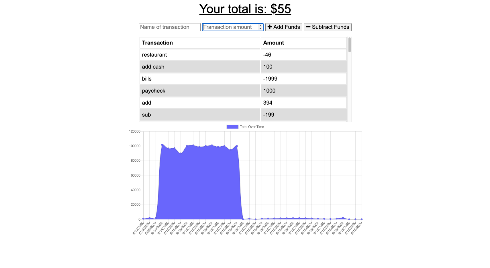

# progressive-budget
# Deployed Heroku site : https://murmuring-everglades-81079.herokuapp.com/

## Description
Budget application that allows users to add offline transactions and syncs them once the app is back online

## Table of Contents
#### [Installation](https://github.com/CD-prog/progressive-budget#installation-1)
#### [Usage information](https://github.com/CD-prog/progressive-budget#usage-information-1)
#### [License](https://github.com/CD-prog/progressive-budget#license-1)
#### [Contributing](https://github.com/CD-prog/progressive-budget#contributing-1)
#### [Tests](https://github.com/CD-prog/progressive-budget#tests-1)
#### [Questions](https://github.com/CD-prog/progressive-budget#questions-)

## Installation
Run 'npm i' in terminal

## Usage information
'npm start' then open http://localhost:3000/ in browser

## License
MIT

## Contributing
Pull requests welcome

## Tests
n/a

## Questions ?
### https://github.com/cd-prog
### c.diaconeasa@gmail.com
